<!-- ============ HEADER ============ -->

 

&nbsp;

&nbsp;

---

## 🧭 About Me

Investment Principal in New York, working across systematic trading and mobility operations. A decade in quantitative finance covering the full lifecycle: **alpha research → strategy development → risk management → execution**.

### 💼 Career

- 🌊 **Now — Investment Principal** — **Atlantic Partners**: fund distribution & capital introduction, connecting US investors with institutional-quality, EU-regulated strategies across fixed income, alternatives, and equities. Also working on a systematic algorithmic trading system and mobility operations.
- ⚡ **Pico** (2023 – 2026, NYC) — Engineer on low-latency trading infrastructure and market data systems, working with the **Redline Trading Solutions** stack: ultra-low-latency feed handlers, order execution gateways, and latency-sensitive production environments supporting institutional clients on execution technology.
- 📊 **ACCI Capital Investments** (2016 – 2023) — Senior Quantitative Researcher; co-managed multi-asset UCITS funds for pension funds, insurance companies, and family offices. Built deep-learning models for US equity regime forecasting and dynamic allocation frameworks that reduced drawdowns through the 2020 COVID crisis. Led manager selection with full operational and investment due diligence.
- 📈 **GAR Investment Managers** (2016) — Quantitative Researcher.

### 🎓 Education

**MS Data Science** — Fordham University · **MS Data Science for Finance** — CUNEF · **MS Applied Mathematics** — Universitat Politècnica de Catalunya · **Telecommunications Engineering** — Universitat Ramon Llull

## 🔬 Current Focus

| Area | What I'm working on |
| :--- | :--- |
| 🌊 **Atlantic Partners** — primary focus | Fund distribution & capital introduction — bringing institutional-quality, EU-regulated strategies (fixed income, alternatives, equities) to US investors seeking diversification |
| 🧠 **Algorithmic trading system** | Uncorrelated systematic futures strategies — supervised ML alpha models layered with a deep reinforcement learning (PPO) execution agent, market-microstructure feature research, walk-forward validation with transaction-cost-aware backtesting, and live execution infrastructure |
| 🚕 **Mobility operations** | Optimization and data-driven decision making applied to urban mobility, fleet & ride operations |
| 🐾 **[PawSync](https://www.pawsync.org)** | Rescue-coordination platform for animal rescue organizations, built end-to-end — turns social-media engagement into organized volunteer action (foster, transport, adopt, pledge), with AI-assisted triage of volunteer responses |
| 🎙️ **Real-time AI voice filter** | Desktop app that isolates your voice and removes background noise as you speak — rebuilt around true streaming, so the delay is imperceptible on live calls and streams, with smart gating that keeps pauses truly silent (no keyboard or room bleed between phrases), high-fidelity output, and a studio-quality cleanup mode for recordings — fully local, no cloud |
| 🌐 **Production software** | A portfolio of private full-stack tools — health tracking, analytics dashboards, knowledge vaults — built and run in production for daily use |
| 🤖 **AI-assisted engineering** | Everything above is built and operated with AI as a force multiplier — treating Claude Code as a programmable platform rather than a chat tool: reusable skills for recurring procedures, deterministic hooks for self-verifying loops (work can't complete until tests and checks pass), subagent orchestration with context isolation and per-task model selection, persistent agent memory across sessions, plugins and MCP integrations, and parallel sessions/worktrees that research, build, review, and deploy end-to-end |

## 📂 Selected Work

- **[reality-explained](https://github.com/gjordj/reality-explained)** — an interactive walkthrough of modern physics, information, and consciousness; every claim tagged by epistemic status, null results included · [live site](https://reality-explained.vercel.app)
- **[spotify-popularity-prediction](https://github.com/gjordj/spotify-popularity-prediction)** — what makes a song popular? Predicting Spotify popularity from a track's audio characteristics alone, across 56k+ songs (2008–2019), with a 2026 revisit of the original study. The recipe that emerges: danceable, loud, short, darker-toned, with vocals — though sound shapes popularity only at the margins; fame, playlisting, and marketing do the rest
- **facial-tension-detection** (private) — computer-vision biofeedback from a webcam: flags facial tension in real time and tracks time spent tense vs. relaxed, so you can notice and unlearn the habit. Privacy-first — no face images are ever stored

## 💬 Ask Me About

`Deep Learning` · `Machine Learning` · `Reinforcement Learning` · `Computer Vision` · `NLP` · `AI-Assisted Engineering` · `Claude Code & Agentic Workflows` · `Skills, Hooks & Subagents` · `Multi-Agent Orchestration` · `Context Engineering` · `Market Microstructure` · `Feed Handlers` · `Order Execution Gateways` · `Tick-to-Trade Latency` · `Co-location` · `Alpha Research` · `Feature Engineering` · `Portfolio Management` · `Manager Selection` · `UCITS & Multi-Asset Funds` · `Risk Management` · `Statistical Analysis` · `Operations Research` · `Optimization & Logistics` · `Real-Time Data Pipelines` · `Genomics & Deep Transformers`

## 🛠️ Tech Stack

**Quant & Machine Learning**

      

**Low-Latency & Systems**

    

**Product & Web**

   

**AI & Agents**

   

## 📊 GitHub Stats

  

---

📫 **Reach me:** [jtmejon@gmail.com](mailto:jtmejon@gmail.com)

