<!-- ============ HEADER ============ -->

 

&nbsp;

&nbsp;

---

**[About](#-about-me) · [Career](#-career) · [Education](#-education) · [Current Focus](#-current-focus) · [Selected Work](#-selected-work) · [Ask Me About](#-ask-me-about) · [Tech Stack](#-tech-stack)**

---

## 🧭 About Me

Investment Principal in New York, working across systematic trading and mobility operations. A decade in quantitative finance covering the full lifecycle: **alpha research → strategy development → risk management → execution**.

### 💼 Career

- 🌊 **Now — Investment Principal** — **Atlantic Partners**: fund distribution & capital introduction, connecting US investors with institutional-quality, EU-regulated strategies across fixed income, alternatives, and equities. Also working on a systematic algorithmic trading system and mobility operations.
- ⚡ **Pico** (2023 – 2026, NYC) — Engineer on low-latency trading infrastructure and market data systems, working with the **Redline Trading Solutions** stack: ultra-low-latency feed handlers, order execution gateways, and latency-sensitive production environments supporting institutional clients on execution technology.
- 📊 **ACCI Capital Investments** (2016 – 2023) — Senior Quantitative Researcher; co-managed multi-asset UCITS funds for pension funds, insurance companies, and family offices. Built deep-learning models for US equity regime forecasting and dynamic allocation frameworks that reduced drawdowns through the 2020 COVID crisis. Led manager selection with full operational and investment due diligence.
- 📈 **GAR Investment Managers** (2016) — Quantitative Researcher.

### 🎓 Education

**MS Data Science** — Fordham University · **MS Data Science for Finance** — CUNEF · **MS Applied Mathematics** — Universitat Politècnica de Catalunya · **Telecommunications Engineering** — Universitat Ramon Llull

## 🔬 Current Focus

| Area | What I'm working on |
| :--- | :--- |
| 🌊 **Atlantic Partners** — primary focus | Fund distribution & capital introduction — bringing institutional-quality, EU-regulated strategies (fixed income, alternatives, equities) to US investors seeking diversification |
| 🧠 **Algorithmic trading system** | Uncorrelated systematic futures strategies — supervised ML alpha models layered with a deep reinforcement learning (PPO) execution agent, market-microstructure feature research, walk-forward validation with transaction-cost-aware backtesting, and live execution infrastructure |
| 🚕 **Mobility operations** | Optimization and data-driven decision making applied to urban mobility, fleet & ride operations |
| 🐾 **[PawSync](https://www.pawsync.org)** | Rescue-coordination platform for animal rescue organizations, built end-to-end — turns social-media engagement into organized volunteer action (foster, transport, adopt, pledge), with AI-assisted triage of volunteer responses |
| 🎙️ **Real-time AI voice filter** | Desktop app that isolates your voice and removes background noise as you speak — a true-streaming rebuild keeps the delay imperceptible on live calls, with smart gating that holds pauses truly silent (no keyboard or room bleed between phrases) and a studio-quality cleanup mode for recordings. Fully local, no cloud |
| 🌐 **Production software** | A portfolio of private full-stack tools — health tracking, analytics dashboards, knowledge vaults — built and run in production for daily use |
| 🤖 **AI-assisted engineering** | Everything above is built and operated with AI as a force multiplier — treating Claude Code as a programmable platform, not a chat tool: reusable skills for recurring procedures, deterministic hooks that block completion until tests and checks pass, subagent orchestration with context isolation and per-task model selection, persistent memory across sessions, MCP integrations, and parallel worktrees that research, build, review, and deploy end-to-end |

## 📂 Selected Work

- **reality-explained** (private) — an interactive walkthrough of modern physics, information, and consciousness; every claim tagged by epistemic status, null results included · [live site](https://reality-explained.vercel.app)
- **spotify-popularity-prediction** (private) — what makes a song popular? Predicting Spotify popularity from a track's audio characteristics alone, across 56k+ songs (2008–2019), with a 2026 revisit of the original study. The recipe that emerges: danceable, loud, short, darker-toned, with vocals — though sound shapes popularity only at the margins; fame, playlisting, and marketing do the rest · [live report](https://spotify-popularity-prediction.vercel.app)
- **golf-shot-analysis** (private) — 423 of my own 7-iron shots from 9 TrackMan range sessions, run through a Python pipeline that classifies every strike (fat, thin, toe, heel) and ball flight (draw, fade, push, pull) from launch-monitor physics, then benchmarks them against tour-level ranges on an interactive dashboard. The data is humbling and honest — median carry ~60 yds — which is exactly the point: measuring the baseline is how it improves · [live dashboard](https://golf-shot-analysis.vercel.app)
- **wine-tasting-analysis** (private) — what does a wine's chemistry actually tell us about its quality? A multi-dataset study of 42,000+ wines that separates the signal that holds up from the claims that don't: alcohol and low volatile acidity track quality, wines fall into a handful of natural style clusters, and chemistry explains only part of what tasters reward. Evaluated on a held-out set under a leak-free pipeline — genuinely useful, but far from deterministic · [live report](https://wine-tasting-analysis.vercel.app)
- **dynamic-portfolio-rl** (private) — can Markowitz be beaten? A weekly long-short max-Sharpe portfolio with dynamically forecast parameters (ARIMA, SES, VARMA, XGBoost, LightGBM, LSTM, plus an EWMA-LSTM covariance model) head-to-head against a DDPG reinforcement-learning agent allocating across five ETFs through the COVID crash. Static Markowitz won the original 2019–20 test window — but a 2026 rebuild of the research (TF1 notebooks → typed TF2 package) under a strict leak-free, walk-forward evaluation showed the verdict flips when the window ends in the drawdown instead of the recovery: dynamic covariance estimation protects capital exactly when risk shows up. The RL agent compounded +91.7% in its 2018 test period
- **facial-tension-detection** (private) — computer-vision biofeedback from a webcam: flags facial tension in real time and tracks time spent tense vs. relaxed, so you can notice and unlearn the habit. Privacy-first — no face images are ever stored
- **self-peptide space** (private) — computational immuno-oncology research in collaboration with a lab at the Icahn School of Medicine at Mount Sinai: can a tumor's mutated peptides be told apart from their healthy wild-type counterparts, and does that difference predict whether the immune system detects them? A rigorous, leak-free analysis lands a clear answer. Among confirmed binders, how tightly a mutated peptide binds the immune system's presentation machinery does *not* predict whether it gets detected — and neither do the field's favored "altered-self" shortcuts (how foreign or how changed the mutation looks), each tested head-to-head and landing near chance. On this 12-patient cohort, immune detection is only weakly predictable from sequence, sitting just below the frontier of the best published models — independently reproducing the field's hard-won consensus that recognition takes both presentation and context, not any single score. But the story doesn't end on a null: re-running the *same* honest pipeline on a 9,000-peptide public benchmark lifts the signal from chance to the field's ceiling (~0.63, and ~0.7 with non-linear models), showing this is a *data-scale problem, not a cleverer-score one* — a smarter feature on 12 patients wouldn't have helped; more data does. Negative results reported rather than buried, and the positive half earned with the same discipline

## 💬 Ask Me About

`Alpha Research` · `Market Microstructure` · `Low-Latency / HFT Infrastructure` · `Feed Handlers` · `Order Execution Gateways` · `Tick-to-Trade Latency` · `Co-location` · `Portfolio & Risk Management` · `UCITS & Multi-Asset Funds` · `Manager Selection` · `Machine Learning` · `Deep Learning` · `Reinforcement Learning` · `Computer Vision` · `Operations Research & Optimization` · `AI-Assisted Engineering` · `Claude Code & Agentic Workflows` · `Multi-Agent Orchestration`

## 🛠️ Tech Stack

**Quant & Machine Learning**

      

**Low-Latency & Systems**

    

**Product & Web**

   

**AI & Agents**

   

---

📫 **Reach me:** [jtmejon@gmail.com](mailto:jtmejon@gmail.com)

